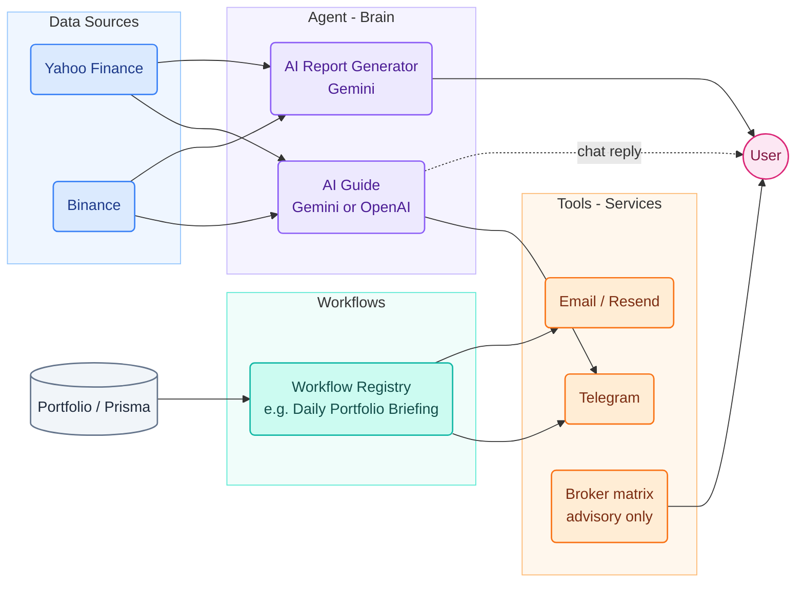

# Alpha-Trade Engine

A paper-trading terminal with an AI guide layered on top: live market data, pattern/signal
analysis, a practice portfolio, and direct Gemini or OpenAI chat assistance.

**This app is simulated and advisory only.** There is no live order execution and no broker OAuth
— the broker recommendation matrix suggests brokers matching your investing style, it never places
trades or moves money. Nothing here is financial advice.

## Getting started

```bash
npm install

# Brings up Postgres, Redis, and the Python ai-engine (see docker-compose.yml)
docker compose up -d

cp .env.example .env   # fill in the values you have — see "Environment variables" below
npm run prisma:generate
npx prisma migrate deploy --schema packages/database/prisma/schema.prisma

npm run dev   # runs apps/web (Next.js), apps/api (NestJS), and ai-engine concurrently
```

- Web: http://localhost:3000
- API: http://localhost:3001
- AI engine (Python/FastAPI): http://localhost:8000

## Environment variables

All variables live in `.env` at the repo root (see `.env.example`), shared by `apps/api` and
`packages/ai-engine`.

| Variable | Required for | Notes |
| --- | --- | --- |
| `POSTGRES_USER` / `POSTGRES_PASSWORD` / `POSTGRES_DB` | Database | Used by `docker-compose.yml` and `DATABASE_URL` |
| `DATABASE_URL` | Database | Prisma connection string |
| `REDIS_URL` | — | Provisioned via `docker-compose.yml`; not currently consumed by any code |
| `AI_ENGINE_URL` | `apps/api` → `packages/ai-engine` calls | Defaults to `http://localhost:8000` |
| `JWT_SECRET` | Auth | Any random string in dev |
| `ADMIN_EMAILS` | Assistant config editing / feedback log | Comma-separated emails; blocked for everyone if unset |
| `AI_ENGINE_SHARED_SECRET` | Locks down the ai-engine's public URL | A strong random string that must match on both `apps/api` and `packages/ai-engine` |
| `WEB_ORIGIN` | CORS and payment redirects | Comma-separated trusted web origins; required in production |
| `GEMINI_API_KEY` | Default AI Guide chat, AI Insight Reports / Market News Explainer / Company Reports | [Google AI Studio](https://aistudio.google.com/apikey) |
| `OPENAI_API_KEY` / `OPENAI_MODEL` | Optional OpenAI AI Guide selection | OpenAI Platform API key and a model enabled for that project |
| `TELEGRAM_BOT_TOKEN` | Telegram bot (bot stays disabled if unset) | See "Components" below |
| `RESEND_API_KEY` | Daily report emails (feature disabled if unset) | [resend.com](https://resend.com) dashboard |
| `STRIPE_SECRET_KEY` | AI Guide chatbot $5 paywall (chat stays unlocked for everyone if unset) | [dashboard.stripe.com/test/apikeys](https://dashboard.stripe.com/test/apikeys) (use a `sk_test_...` key) |
| `BACKEND_API_URL` | Vercel/Next server proxy → API | Defaults to `http://localhost:3001`; never exposed to browser code |
| `NEXT_PUBLIC_TELEGRAM_BOT_USERNAME` | "Connect Telegram" deep link | Your bot's `@username` |

## Architecture



The AI Guide is reachable from the web chat widget and from the Telegram bot's `/ask` command;
both funnel through the same `AssistantService.chat()` entry point. Workflows are started from
their explicit controls on the Workflows page.

## Components

See `/components` in the running app for a live status board of everything below.

### Data Connectors

- **Yahoo Finance** / **Binance** — no API key required, public endpoints.
- **Telegram account link** — see the Telegram bot token steps below, then use "Connect Telegram"
  in Settings.

### Agent (Brain)

- **AI Guide** — Gemini is the default provider. OpenAI is available only when explicitly selected,
  using `OPENAI_API_KEY` and `OPENAI_MODEL`.
- **AI Report Generator** (Gemini) — get an API key at
  [Google AI Studio](https://aistudio.google.com/apikey), set `GEMINI_API_KEY`.

### Tools (Services)

- **Email (Resend)** — get an API key from your [resend.com](https://resend.com) dashboard, set
  `RESEND_API_KEY`.
- **Telegram bot**:
  1. Open Telegram and message [@BotFather](https://t.me/BotFather).
  2. Send `/newbot` and follow the prompts.
  3. Copy the token BotFather gives you into `TELEGRAM_BOT_TOKEN`.
  4. Restart `apps/api`, then link your own account from Settings and try the "Telegram Test
     Message" component at `/components/telegram-test`.
- **Broker recommendation matrix** — no API key; it's a static, advisory-only suggestion list, not
  a live broker connection.
- **Stripe (AI Guide chatbot paywall)** — a one-time $5 charge unlocks chat for a signed-in user;
  chat stays unlocked for everyone if unset.
  1. Create a free account at [stripe.com](https://stripe.com) (no bank account needed for test mode).
  2. Make sure **Test mode** is on (top right of the dashboard).
  3. Go to **Developers → API keys** and copy the **Secret key** (starts with `sk_test_...`).
  4. Set `STRIPE_SECRET_KEY` to that value.
  5. Test with card number `4242 4242 4242 4242`, any future expiry, any 3-digit CVC.
